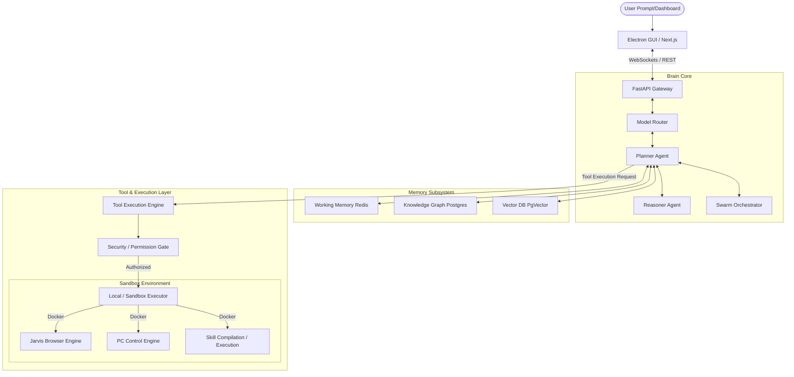

# 05_SYSTEM_ARCHITECTURE.md

## Purpose
This document provides the high-level system architecture and block diagrams of JARVIS OS. It details the runtime loop, component relationships, and boundary interfaces between system modules.

## Scope
Defines the structure of the core brain, tool execution layers, custom browser subsystems, PC automation controls, and security sandboxes.

## System Architecture Diagram
The system follows a strict layered architecture to prevent circular dependencies and maintain clean boundaries:

## Subsystem Details
1. **API Gateway (FastAPI):** Controls state management, session creation, and aggregates telemetry streams from active agents.
2. **Brain Core:** Runs the model router, processes goal-decomposition trees, and coordinates swarms.
3. **Memory Subsystem:** Handles vector searches, graph node traversals, and fast session caches.
4. **Tool Layer:** Decoupled execution ports. All tool calls, browser navigations, and terminal commands must route through this security-gated interface.
5. **Sandbox (Docker):** Contains all executing code generated by the agent or third-party skills to prevent host infection.

## Responsibilities
- **AI Developer:** Build modules according to these architectural boundaries.
- **AI Reviewer:** Audit PRs to check that tool executions do not bypass the `SecGate` block.

## Dependencies
- Must strictly adhere to the [00_PROJECT_CONSTITUTION.md](file:///e:/jarvis/docs/00_PROJECT_CONSTITUTION.md).

## Interfaces
- Restricts direct component interactions: Brain Core cannot access local resources directly; it must route requests through the Tool Layer.

## Examples
- **Correct Flow:** Planner -> requests browser scrape -> routes to Tool Layer -> SecGate approves -> Playwright launches inside Docker.
- **Incorrect Flow:** Planner -> directly imports Playwright -> launches local Chrome instance. (Violates architectural isolation).

## Failure Cases
- **Layer Bypass:** A developer imports terminal controllers directly into the reasoning engine. *Mitigation:* Automated code scanner (Quality Gates) checks for forbidden imports outside `/core/tools/`.

## Security Considerations
- The sandbox layer is isolated from host network interfaces, except for a secure loopback proxy to route local API payloads.

## Future Extension
- Modifying the core architecture layers requires updating the ADR document and human approval.

## Related Documents
- [00_PROJECT_CONSTITUTION.md](file:///e:/jarvis/docs/00_PROJECT_CONSTITUTION.md)
- [04_TECHNICAL_REQUIREMENTS.md](file:///e:/jarvis/docs/04_TECHNICAL_REQUIREMENTS.md)
- [06_ARCHITECTURE_DECISION_RECORDS.md](file:///e:/jarvis/docs/06_ARCHITECTURE_DECISION_RECORDS.md)
- [69_SYSTEM_DEPENDENCY_GRAPH.md](file:///e:/jarvis/docs/69_SYSTEM_DEPENDENCY_GRAPH.md)
