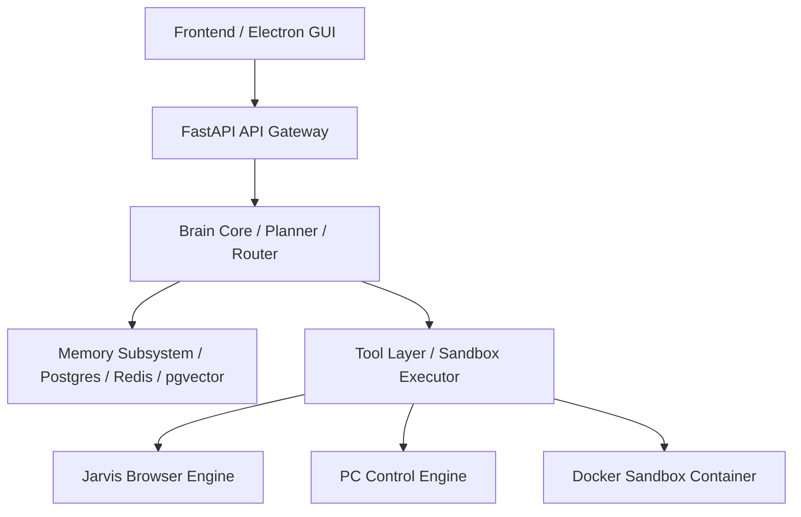

# 69_SYSTEM_DEPENDENCY_GRAPH.md

## Purpose
This document defines the System Dependency Graph for JARVIS OS. It establishes the architectural layout between modules, import hierarchies, and cycle checks to prevent circular dependencies during development.

## Scope
Applies to all module configurations, imports, and quality gates checks inside the repository.

## Dependency Graph & Import Hierarchy
To prevent circular references and maintain module isolation, the system follows a strict one-way dependency flow:

### Dependency Rules
1. **One-Way Import Rule:** Higher layers can import from lower layers, but lower layers must never import from higher layers:
   - *Example:* The API gateway can import from the Brain Core, but the Brain Core cannot import from the API gateway.
   - *Example:* Memory modules cannot import from the Brain Core or Planner.
2. **Horizontal Import Restraints:** Parallel modules at the same level (e.g. Browser Engine and PC Control Engine) must not import from each other directly; they must interact via the Tool Layer.

## Responsibilities
- **Reviewer Agent:** Scans imports during pull requests to verify compliance with this dependency graph.
- **Developer Agent:** Verifies code references are compliant before committing modules.

## Dependencies
- Must strictly adhere to the [00_PROJECT_CONSTITUTION.md](file:///e:/jarvis/docs/00_PROJECT_CONSTITUTION.md) (specifically Rule 2, Rule 5, and Rule 14).

## Interfaces
- Input: Code imports data parsed by python dynamic syntax trees.
- Output: Dependency graph checks in Quality Gates.

## Examples
- **Correct Import:** `core/brain/planner.py` imports `core/memory/postgres_client.py`.
- **Incorrect Import:** `core/memory/postgres_client.py` imports `core/brain/planner.py`. (Violates One-Way Import Rule).

## Failure Cases
- **Circular References:** A developer introduces a database lookup loop inside a configurations loader, causing a system crash during boot. *Mitigation:* The Quality Gates execute a static import analyzer. If a cycle is detected, the build fails and merges are blocked.

## Security Considerations
- Restricting import directions ensures that security modules cannot be manipulated by unprivileged tool clients.

## Future Extension
- Modifying import directions requires updating this graph and logging an ADR entry.

## Related Documents
- [00_PROJECT_CONSTITUTION.md](file:///e:/jarvis/docs/00_PROJECT_CONSTITUTION.md)
- [05_SYSTEM_ARCHITECTURE.md](file:///e:/jarvis/docs/05_SYSTEM_ARCHITECTURE.md)
- [31_FOLDER_STRUCTURE_STANDARD.md](file:///e:/jarvis/docs/31_FOLDER_STRUCTURE_STANDARD.md)
- [47_QUALITY_GATES.md](file:///e:/jarvis/docs/47_QUALITY_GATES.md)
- [58_PHASE_BUILD_ORDER.md](file:///e:/jarvis/docs/58_PHASE_BUILD_ORDER.md)
