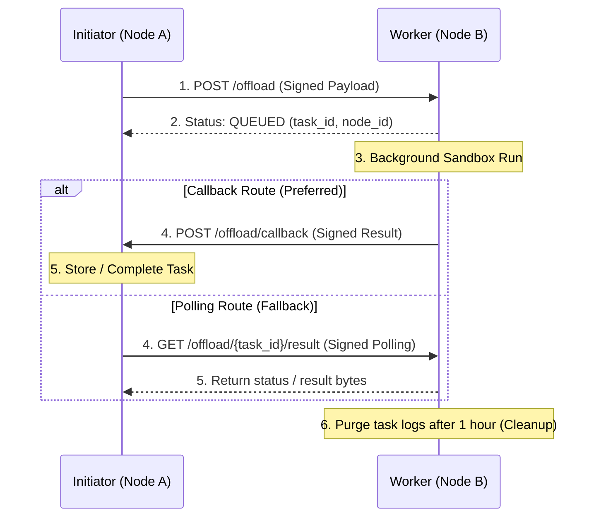

# Phase 35: Distributed Task Offloading & Scale Implementation Plan (DRAFT)

This document details the implementation plan for **Phase 35: Distributed Task Offloading & Remote Tool Execution** using the approved **Option B (Additive-Only) Architecture**. It ensures absolute adherence to project governance by keeping frozen Phase 31 code files untouched.

---

## 1. Architectural Strategy (Option B Rationale)

### 1.1 Rationale for Additive-Only Strategy
Under the project's governance framework (**AGENTS.md §4 & §6**), Phase 31 is officially **FROZEN** (representing 1086 passing tests). Modifying any frozen module (such as [federation.py](file:///e:/jarvis/core/runtime/federation.py) or [federation.py](file:///e:/jarvis/api/routes/federation.py)) directly would violate strict quality gate policies and introduce regression risks to the core peer-to-peer message bus.

Option B keeps Phase 31 interfaces completely untouched by:
1. Routing scale operations through new files: [scale.py](file:///e:/jarvis/core/runtime/scale.py) and [federation_scale.py](file:///e:/jarvis/api/routes/federation_scale.py).
2. Importing and reusing the existing cryptographic validator dependency `verify_federation_signature` directly from the frozen route interface.
3. Mounting the new router `federation_scale.router` under the central app interface (`api/main.py`) with prefix `/api/v1` to seamlessly merge namespaces, exposing a unified public REST endpoint (`/api/v1/federation/...`) without changing existing routing logic.

---

## 2. Load-Metrics Cache TTL Decision & Reasoning

- **Decision:** Load metrics queried from peer nodes will be cached locally in `ScaleManager` with a **2–3 second Time-to-Live (TTL)**.
- **Reasoning:**
  - *Why not 0 seconds?* Querying peer load metrics in real-time on every task decomposition would create severe latency penalties and API storms under high request rates.
  - *Why not 5+ seconds?* In highly concurrent environments with rapidly changing workloads, a cache TTL of 5 seconds or longer causes herd effects (multiple parallel tasks deterministically routing to the same worker node before its updated load metrics are fetched, leading to worker overloading).
  - *Why 2–3 seconds?* 2-3 seconds represents the optimal trade-off point: it is long enough to avoid micro-polling peer nodes, and short enough to reflect dynamic load swings, ensuring highly dynamic balance distribution.

---

## 3. Asynchronous Offloaded Task Lifecycle

To prevent long-running tasks from blocking HTTP requests, the following lifecycle is established:

1. **Submission:** Initiator (Node A) signs the task payload and sends it via `POST /api/v1/federation/offload`.
2. **Queueing & Receipt:** Worker (Node B) verifies the HMAC signature. If validated, Node B assigns a unique `task_id`, sets status to `QUEUED`, and returns a receipt `{ "status": "QUEUED", "task_id": "...", "node_id": "..." }` within 100ms.
3. **Execution:** The task is executed in Node B's background loop within `LocalSubprocessSandbox`. Standard output, standard error, and exit codes are recorded.
4. **Completion / Status Retrieval:**
   - *Push Path (Callback):* Upon task completion, Node B signs the result envelope and issues an HTTP POST callback to Node A's `/api/v1/federation/offload/callback`.
   - *Pull Path (Polling Fallback):* Node A can poll Node B's endpoint `GET /api/v1/federation/offload/{task_id}/result` (protected by HMAC signature checks) to retrieve progress.
5. **Failure & Error Propagation:** If Node B fails during sandbox initialization or times out, the error status (`FAILED`) along with sandbox `stderr` is transmitted in the callback payload.
6. **Cleanup:** Worker nodes cache task outcomes in their SQLite persistence DB, with an automatic background cleanup job purging run metadata older than 1 hour.

---

## 4. Security Boundaries & Isolation Invariants

- **HMAC Authentication:** All endpoints verify the `X-Jarvis-Signature` header. The signature is computed using a shared federation key from the Vault:
  $$Signature = HMAC\_SHA256(Secret, 1 + MessageId + NodeId + Timestamp + Nonce + KeyId + CreatedAt + Body)$$
- **Replay Attack Protection:** New routes leverage the `verify_federation_signature` middleware. This enforces a 5-minute freshness check on the request timestamp (`X-Jarvis-Timestamp`) and caches `message_id` and `nonce` values to discard replayed requests.
- **Sandbox Isolation:** Remote tasks cannot access the host machine's command line or file system. All code execution is forced inside `LocalSubprocessSandbox`. Any remote request targeting non-sandboxed tools (e.g. `shell_runtime`) will be rejected with an HTTP 403 Forbidden.
- **Authorization Expectations:** Querying metrics (`/api/v1/federation/load`) or registering nodes requires `platform.admin` permission scopes, validating active user request contexts.

---

## 5. Proposed Changes & Explicit File Ownership

| Component / Path | Action | Type | Responsibility |
|------------------|--------|------|----------------|
| [scale.py](file:///e:/jarvis/core/runtime/scale.py) | **NEW** | Core Service | Implements `ScaleManager`. Handles load metric retrieval caching (2-3s TTL), deterministic lowest-load node selection, and remote tool dispatching. |
| [federation_scale.py](file:///e:/jarvis/api/routes/federation_scale.py) | **NEW** | API Routes | Exposes `/federation/offload`, `/federation/tools/execute`, `/federation/load`, and `/federation/offload/callback` endpoints. All are gated by P2P signature checking middleware. |
| [test_distributed_scale.py](file:///e:/jarvis/tests/test_distributed_scale.py) | **NEW** | Tests | Unit and integration tests covering the complete offload lifecycle, validation, load balancer caching, and security boundary violations. |
| [kernel.py](file:///e:/jarvis/core/kernel.py) | **MODIFY** | System Boot | Registers the new `ScaleManager` singleton in the DI container. |
| [dependencies.py](file:///e:/jarvis/api/dependencies.py) | **MODIFY** | Dependency Bridge | Exposes `get_scale_manager(kernel: Kernel = Depends(get_kernel))` for router route handlers. |
| [main.py](file:///e:/jarvis/api/main.py) | **MODIFY** | REST App | Includes `federation_scale.router` during lifespan startup phase. |

---

## 6. Verification and Test Strategy

We will run a dedicated validation suite inside [test_distributed_scale.py](file:///e:/jarvis/tests/test_distributed_scale.py):

### 6.1 Positive Test Cases
- Verify Node A query selects Node B as target when Node B reports the lowest metrics.
- Verify remote `python_sandbox` tool executes code, returning the correct `stdout` and `stderr` through the signature validation gate.
- Assert load metrics cache is stored, and repeated hits query local cache during the 2–3s TTL window rather than calling peers.

### 6.2 Negative & Security Test Cases (Failsafe Verification)
- **Signature Modification:** Manually tamper with signature bytes on payload POST; assert HTTP 401 Unauthorized is returned.
- **Expired Timestamp:** Send a signature carrying a timestamp older than 300 seconds; verify it is rejected.
- **Replay Protection:** Attempt to send a duplicate request containing a previously verified `message_id` or `nonce`; verify rejection.
- **Unauthorized Tools:** Dispatch a tool request for `shell_runtime` (local shell execution); assert HTTP 403 Forbidden is returned and the tool is not executed.
- **Unknown Node Rejection:** Attempt signature checks using a peer node ID absent from the peer registry; verify failure.
