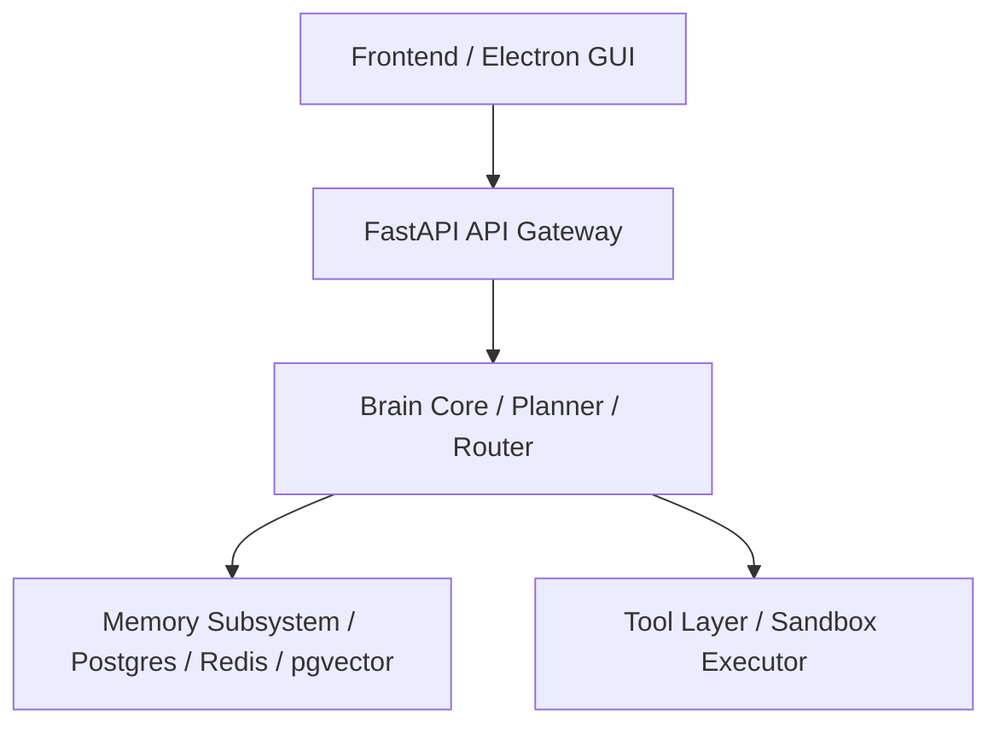

# 01_ARCHITECTURE_FREEZE.md

## Purpose
This document freeze-locks the core system architecture, structural layers, dependency flows, and interface boundaries of JARVIS OS to prevent architectural drift during development.

## Scope
Applies to all backend API endpoints, internal packages, and communication interfaces in the repository.

## Immutability Policy
This freeze document is strictly immutable. Future changes require:
```
Architecture Decision Record (ADR) → Impact Analysis → Human Approval → Version Increment
```

## System Layers & Dependency Graph
The system is divided into four strictly isolated execution layers. Lower layers must never import or reference higher layers:



### Public API Endpoints (Frozen)
- `POST /api/v1/sessions`: Instantiates a new agent session.
- `POST /api/v1/goals`: Dispatches a goal target to the planner.
- `GET /api/v1/tasks/{task_id}`: Retrieves details and checklist status.
- `GET /api/v1/health`: Returns system telemetry status.

## Responsibilities
- **System Supervisor:** Enforces layer boundaries during execution.
- **Reviewer Agent:** Scans imports during compile and blocks commits that violate these boundaries.

## Dependencies
- Must strictly adhere to the [00_PROJECT_CONSTITUTION.md](file:///e:/jarvis/docs/00_PROJECT_CONSTITUTION.md).

## Interfaces
- REST Gateway: `/api/v1/`.
- WebSocket Gateway: `/ws/v1/telemetry`.

## Examples
- **Correct Flow:** An API route invokes `Planner.run()`, which queries `Memory.search()` and executes `Tool.run()` inside Docker.
- **Incorrect Flow:** A database model client file imports the `Planner` class to check goals. (Violates One-Way Layer rule).

## Failure Cases
- **Layer Leaks:** A developer uses a shortcut import across subsystems. *Mitigation:* The Quality Gates block the build if code analysis tools identify cyclical references or unauthorized layer-skips.

## Security Considerations
- Restricting import directions prevents unprivileged scripts running in the Tool Layer from accessing database credentials or session key vaults directly.

## Future Extension
- Modifications to core layers require an ADR update before code changes can be merged.

## Related Documents
- [00_PROJECT_CONSTITUTION.md](file:///e:/jarvis/docs/00_PROJECT_CONSTITUTION.md)
- [05_SYSTEM_ARCHITECTURE.md](file:///e:/jarvis/docs/05_SYSTEM_ARCHITECTURE.md)
- [06_ARCHITECTURE_DECISION_RECORDS.md](file:///e:/jarvis/docs/06_ARCHITECTURE_DECISION_RECORDS.md)
- [10_REPOSITORY_LAYOUT_FREEZE.md](file:///e:/jarvis/docs/architecture/10_REPOSITORY_LAYOUT_FREEZE.md)
