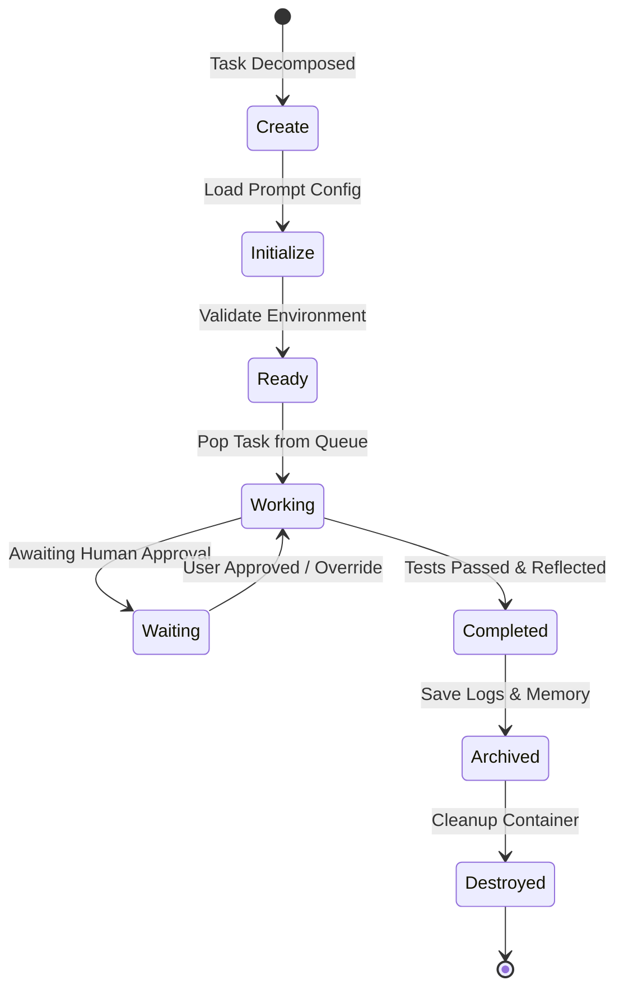

# 13_AGENT_LIFECYCLE_DIAGRAM.md

## Purpose
This document defines the Agent Lifecycle Diagram and sequence rules for all dynamically spawned agents and subagents in JARVIS OS.

## Scope
Applies to the Swarm Orchestrator, Planner Agent loops, container runtimes, and session managers.

## Immutability Policy
This freeze document is strictly immutable. Future changes require:
```
Architecture Decision Record (ADR) → Impact Analysis → Human Approval → Version Increment
```

## Agent Lifecycle Sequence
Active agents and subagents must strictly progress through the lifecycle defined below:



### State Lock Rules
1. **Creation Limit Check:** An agent cannot transition from `Create` to `Initialize` if active concurrent subagents count is greater than 5.
2. **Execution Gate:** An agent in `Working` mode cannot execute files or call external APIs without passing parameter checks (see `18_TOOL_EXECUTION_POLICY.md`).
3. **Graceful Destruction:** Transition to `Destroyed` must perform a complete cleanup of temporary container paths and log buffers.

## Responsibilities
- **Swarm Orchestrator:** Manages state changes, monitors heartbeat signals, and destroys inactive subagent processes.
- **Resource Manager:** Allocates container resources matching the active lifecycle state.

## Dependencies
- Must strictly adhere to the [00_PROJECT_CONSTITUTION.md](file:///e:/jarvis/docs/00_PROJECT_CONSTITUTION.md) (specifically Rule 2, Rule 6, and Rule 11).

## Interfaces
- Input: State updates written to Redis PubSub.
- UI: Dashboard status visualization cards.

## Examples
- **Correct State Transition:** Subagent starts -> `Create` -> `Initialize` -> `Ready` -> runs task in `Working` -> finishes -> `Completed` -> syncs graph -> `Archived` -> container destroyed.
- **Incorrect State Transition:** An agent starts execution directly from `Create` without initialization or verification. (Violates Lifecycle standards).

## Failure Cases
- **Loop Stalls:** An agent gets stuck in `Working` or `Waiting` state indefinitely. *Mitigation:* The orchestrator runs a daemon checker that terminates the agent if no heartbeats or status updates are received within 15 minutes.

## Security Considerations
- The transition path guarantees that the Security Agent validates parameters before `Working` state allows execution.

## Future Extension
- Enhancing lifecycle states requires updating this document via ADR approval.

## Related Documents
- [00_PROJECT_CONSTITUTION.md](file:///e:/jarvis/docs/00_PROJECT_CONSTITUTION.md)
- [08_AI_AGENT_CONSTITUTION.md](file:///e:/jarvis/docs/08_AI_AGENT_CONSTITUTION.md)
- [14_SUBAGENT_ORCHESTRATION.md](file:///e:/jarvis/docs/14_SUBAGENT_ORCHESTRATION.md)
- [61_RUNTIME_STATE_MACHINE.md](file:///e:/jarvis/docs/61_RUNTIME_STATE_MACHINE.md)
