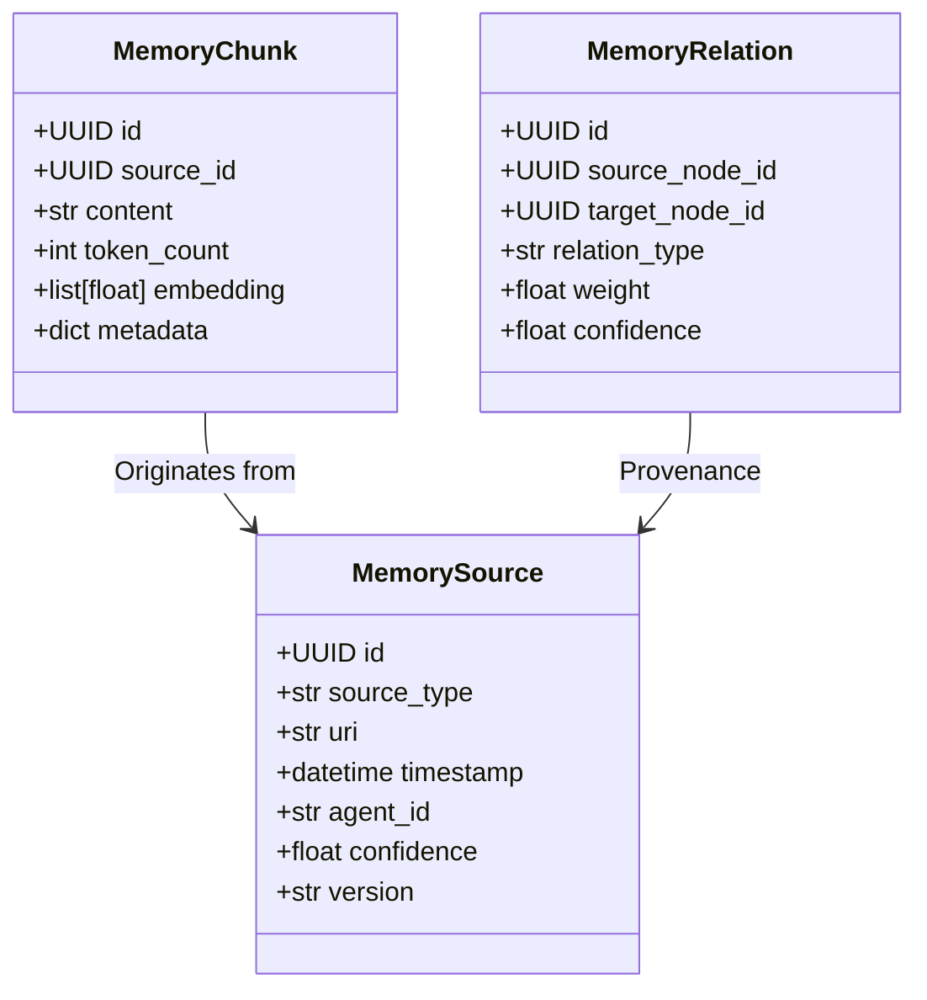
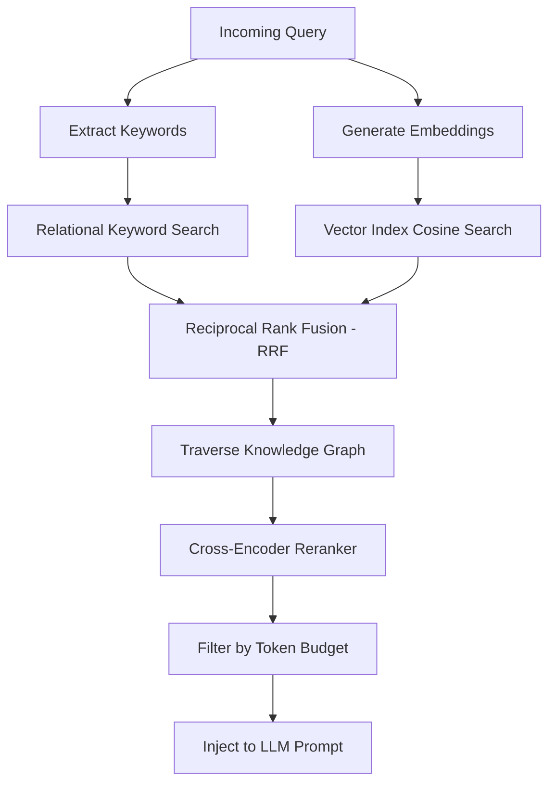

# 14_MEMORY_ENGINE_FREEZE.md

## Purpose
This document freeze-locks the design patterns, schemas, API contracts, retrieval pipelines, scoring formulas, and architectural parameters of the Memory Engine for JARVIS OS. In accordance with the [00_PROJECT_CONSTITUTION.md](file:///e:/jarvis/docs/00_PROJECT_CONSTITUTION.md) (specifically Rule 4: Never delete/alter configurations without justification, Rule 5: Respect architectural boundaries, and Rule 13: Configurable variables rather than hardcoded properties), this specification establishes the single source of truth for the memory subsystem to ensure consistency, model independence, and runtime safety before any production memory code is implemented.

## Scope
Applies to all database schemas (relational and vector), Redis keyspace layouts, in-memory caches, graph representations, and memory lifecycle components. This includes Python models, SQL migrations, repository classes, and API contracts.

---

## Immutability Policy
This freeze document is strictly immutable. Future changes require:
```
Architecture Decision Record (ADR) → Impact Analysis → Human Approval → Version Increment
```

---

## Memory Engine Blueprint

### 1. Memory Entity Model
The memory system is structured into five distinct levels of persistence, represented by the following entity models:

*   **WorkingMemory (L1 - Cache):** Short-lived, high-speed cached state. Stores active task trees, cursor location, temporary workflow variables, and prompt context caches.
*   **SessionMemory (L2 - Relational):** Scoped to the current interaction/run. Stores execution logs, raw tool outputs, active conversation history, and subtask trees.
*   **LongTermMemory (L3 - Relational):** Persistent historical summaries of past sessions, key learning points, and system optimizations across multiple runs.
*   **SemanticMemory (L4 - Vector):** High-dimensional vector representation of text chunks, code files, and external documentation.
*   **ProceduralMemory (L5 - Skills/Workflows):** Stores definitions of active skills, tool schemas, and operational execution policies.
*   **KnowledgeGraph:** A node-and-edge network model representing entities, conceptual relationships, and code dependencies.
*   **MemoryChunk:** The physical token-based fragment containing actual text/code and provenance metadata.
*   **MemoryRelation:** The directed edge between nodes in the Knowledge Graph.
*   **MemorySource:** Traceability model linking memories to files, web URLs, terminal outputs, or user inputs.



---

### 2. Memory Lifecycle
Memory must never be modified directly by reasoning agents. All memory operations must flow through the standardized pipeline:

```
Observe → Normalize → Validate → Deduplicate → Embed → Store → Index → Retrieve → Summarize → Archive
```

1.  **Observe:** Capture inputs, code changes, tool outputs, or execution telemetry.
2.  **Normalize:** Strip whitespace, standardize unicode representations, and enforce clean formatting.
3.  **Validate:** Ensure data is well-formed, sanitizing sensitive keys, passwords, and tokens.
4.  **Deduplicate:** Match incoming memory signatures against active databases using semantic and exact-string filters.
5.  **Embed:** Generate text embeddings using the configured embedding provider.
6.  **Store:** Persist relational and vector metadata into database tables.
7.  **Index:** Insert pgvector HNSW nodes and establish relational edges in the Knowledge Graph.
8.  **Retrieve:** Fetch relevant context based on hybrid search and graph queries.
9.  **Summarize:** Compress retrieved context to fit model token budgets.
10. **Archive:** Compress cold memories and move them to deep storage files.

---

### 3. Retrieval Pipeline
The retrieval pipeline balances precision and speed using a multi-phase query system:



*   **Hybrid Search:** Combined keyword search (BM25 or SQL LIKE/ILIXE) and vector cosine similarity.
*   **Graph Traversal:** Starts at matching semantic nodes and fetches adjacent nodes up to a configurable depth limit.
*   **Re-ranking:** Integrates cross-encoder scores or Reciprocal Rank Fusion (RRF) to filter out noise.

---

### 4. Memory Scoring Model
Memory relevance and retention are determined by a dynamic scoring model:

$$\text{MemoryScore} = (w_{\text{rel}} \cdot \text{Relevance} + w_{\text{imp}} \cdot \text{Importance} + w_{\text{conf}} \cdot \text{Confidence} + w_{\text{fresh}} \cdot \text{Freshness}) \cdot (1 + w_{\text{access}} \cdot \ln(\text{AccessCount}))$$

Where:
*   $\text{Relevance}$: Vector cosine similarity or normalized keyword match score $[0.0, 1.0]$.
*   $\text{Importance}$: Set at ingestion based on agent evaluation of critical information $[0.0, 1.0]$.
*   $\text{Confidence}$: Initial model confidence or source credibility rating $[0.0, 1.0]$.
*   $\text{Freshness}$: Decays exponentially over time: $e^{-\lambda \Delta t}$, where $\lambda$ is the decay rate and $\Delta t$ is the elapsed time.
*   $\text{AccessCount}$: Increments by 1 on every retrieval hit.

Weights are configurable in `config.yaml` and default to:
*   $w_{\text{rel}} = 0.4$
*   $w_{\text{imp}} = 0.3$
*   $w_{\text{conf}} = 0.1$
*   $w_{\text{fresh}} = 0.2$
*   $w_{\text{access}} = 0.15$

---

### 5. Permission Hierarchy
To protect user data and isolate sensitive agent processes, memory access is partitioned into five distinct isolation levels:

| Tier | Name | Read Scope | Write Scope | Retention Policy |
| :--- | :--- | :--- | :--- | :--- |
| **P5** | `System` | Read-only for all agents | Kernel only | Infinite / Persistent |
| **P4** | `Project` | All agents in project | Kernel & System agents | Scoped to project lifecycle |
| **P3** | `Workspace` | Active session agents | Current agent instance | Scoped to workspace path |
| **P2** | `Session` | Current conversation context | Active session instance | Cleaned up on session close |
| **P1** | `Temporary` | In-memory only | Active subtask runner | TTL-based auto-expiry |

---

### 6. Knowledge Graph Schema
The graph data layer represents structural connections. It is implemented in PostgreSQL using the following frozen DDL schemas:

```sql
-- Knowledge Graph Nodes
CREATE TABLE graph_nodes (
    id UUID PRIMARY KEY DEFAULT gen_random_uuid(),
    session_id UUID REFERENCES agent_sessions(id) ON DELETE CASCADE,
    name VARCHAR(255) NOT NULL,
    type VARCHAR(50) NOT NULL, -- 'concept', 'code_symbol', 'file', 'user_preference'
    properties JSONB NOT NULL DEFAULT '{}'::jsonb,
    created_at TIMESTAMP WITH TIME ZONE DEFAULT CURRENT_TIMESTAMP NOT NULL,
    updated_at TIMESTAMP WITH TIME ZONE DEFAULT CURRENT_TIMESTAMP NOT NULL
);
CREATE INDEX idx_graph_nodes_type ON graph_nodes(type);
CREATE INDEX idx_graph_nodes_session ON graph_nodes(session_id);

-- Knowledge Graph Edges (Relationships)
CREATE TABLE graph_edges (
    id UUID PRIMARY KEY DEFAULT gen_random_uuid(),
    source_node_id UUID REFERENCES graph_nodes(id) ON DELETE CASCADE NOT NULL,
    target_node_id UUID REFERENCES graph_nodes(id) ON DELETE CASCADE NOT NULL,
    relation_type VARCHAR(100) NOT NULL, -- 'depends_on', 'part_of', 'references'
    weight REAL DEFAULT 1.0 NOT NULL,
    confidence REAL DEFAULT 1.0 NOT NULL,
    properties JSONB NOT NULL DEFAULT '{}'::jsonb,
    created_at TIMESTAMP WITH TIME ZONE DEFAULT CURRENT_TIMESTAMP NOT NULL,
    CONSTRAINT chk_different_nodes CHECK (source_node_id <> target_node_id)
);
CREATE INDEX idx_graph_edges_source ON graph_edges(source_node_id);
CREATE INDEX idx_graph_edges_target ON graph_edges(target_node_id);
```

---

### 7. Embedding Strategy
The embedding strategy is designed to prevent vendor lock-in and optimize semantic context:

*   **Configurable Dimensions:** Embedding dimensions are model-dependent and configurable. The application reads configuration properties to initialize database vector tables dynamically or checks model metadata to auto-detect vector shapes.
*   **Token-Based Chunking:** All documentation and code chunking must be token-based.
    *   **Default Target:** $400\text{--}600$ tokens per chunk.
    *   **Overlap:** $15\text{--}20\%$ overlap.
*   **Semantic Boundary Respect:**
    *   *For Code:* Chunking splits at class, function, or block boundaries to prevent parsing errors.
    *   *For Documents:* Chunking splits at heading, table, or paragraph boundaries rather than mid-sentence.

```yaml
# Configuration Schema for Embedding Subsystem
embedding:
  provider: auto      # options: auto, openai, ollama, local
  model: configurable # path/name of model
  dimensions: auto    # auto-detect or integer value
```

---

### 8. Vector Storage Abstraction
Decouples vector operations from backend storage engines to facilitate local unit testing:

```python
from abc import ABC, abstractmethod
from typing import Any, List, Optional
from uuid import UUID

class IVectorStoreRepository(ABC):
    @abstractmethod
    async def initialize(self) -> None:
        """Sets up tables, connections, and indices."""
        pass

    @abstractmethod
    async def add_vector(self, vector_id: UUID, embedding: List[float], metadata: dict) -> bool:
        """Inserts or updates a vector with associated metadata."""
        pass

    @abstractmethod
    async def search_vector(
        self, 
        embedding: List[float], 
        limit: int, 
        filter_criteria: Optional[dict] = None
    ) -> List[dict]:
        """Performs cosine similarity search and returns matches."""
        pass

    @abstractmethod
    async def delete_vector(self, vector_id: UUID) -> bool:
        """Deletes a vector by its unique identifier."""
        pass
```

*   **Mock Storage:** A local NumPy or SQLite implementation for lightweight unit tests.
*   **Production Storage:** A PostgreSQL implementation with `pgvector` enabled, utilizing HNSW cosine indexing.

---

### 9. Memory API Contracts
Interface method signatures for the core Memory Engine:

```python
from typing import Any, List, Optional, Union
from uuid import UUID
from pydantic import BaseModel, Field

class MemoryNode(BaseModel):
    id: UUID = Field(default_factory=UUID)
    content: str
    metadata: dict = Field(default_factory=dict)
    importance: float = 0.5
    confidence: float = 1.0

class RetrievalQuery(BaseModel):
    query_text: str
    limit: int = 5
    min_score: float = 0.3
    depth: int = 2

class IMemoryManager(ABC):
    @abstractmethod
    async def store(self, node: MemoryNode, tier: str = "Project") -> UUID:
        """Stores a new memory node in the target persistence tier."""
        pass

    @abstractmethod
    async def retrieve(self, query: RetrievalQuery) -> List[MemoryNode]:
        """Queries the vector database and traverses the knowledge graph."""
        pass

    @abstractmethod
    async def update(self, node_id: UUID, updated_fields: dict) -> bool:
        """Modifies properties or contents of an existing memory node."""
        pass

    @abstractmethod
    async def delete(self, node_id: UUID) -> bool:
        """Permanently removes a node from vector and relational databases."""
        pass

    @abstractmethod
    async def search(self, query_text: str, limit: int) -> List[MemoryNode]:
        """Shortcut for hybrid semantic search without graph traversal."""
        pass

    @abstractmethod
    async def summarize(self, nodes: List[MemoryNode], max_tokens: int) -> str:
        """Generates a compressed representation of multiple memory nodes."""
        pass

    @abstractmethod
    async def archive(self, session_id: UUID) -> bool:
        """Compresses all session memories and pushes them to archive storage."""
        pass

    @abstractmethod
    async def forget(self, query_filter: dict) -> int:
        """Deletes memories matching the specified filtering criteria."""
        pass
```

---

### 10. Memory Test Specification
Verifies system behavior against critical performance thresholds:

1.  **Deduplication Test:** Verify that storing an identical string twice logs a match and increases `AccessCount` instead of creating duplicate database entries.
2.  **Semantic Match Test:** Querying "how to run tests" must retrieve nodes about `pytest` and `uv run` even if the exact words are missing.
3.  **Corruption Test:** Mock database disconnections and confirm the engine fails gracefully using a fallback cache or raises a safe exception (`MemoryEngineException`).
4.  **Archiving Test:** Verify that sessions flagged for archival compress relational rows, remove vector index weights, and dump output files to `docs/archive/`.

---

### 11. Memory Conflict Resolution Policy
When contradictory information is ingested from multiple sources, conflicts are resolved using the following guidelines:

1.  **Source Ranking Matrix:** Information sources are categorized by credibility levels:
    *   *Rank 1 (User Explicit):* Direct user statements via commands or configurations. (Overwrite weight: $1.0$)
    *   *Rank 2 (Git/Codebase):* Local project codebase files and local files. (Overwrite weight: $0.8$)
    *   *Rank 3 (External Docs):* Official websites, downloaded documentation, web searches. (Overwrite weight: $0.6$)
    *   *Rank 4 (LLM Inference):* Hypothesized code snippets, general knowledge defaults. (Overwrite weight: $0.4$)
2.  **Confidence Merging:**
    *   If a newer memory with a higher Rank contradicts an older memory, the older node is updated with a `superseded_by` relationship or marked as archived.
    *   If the Ranks are equal, the update uses an Exponential Moving Average (EMA) for scalar properties and retains both source links in metadata for user disambiguation.

---

### 12. Forgetting & Retention Policy
Enforces system safety and privacy boundaries:

*   **Temporary Expiry:** Items in `Temporary` (L1) memory carry a Time-to-Live (TTL) header. Once expired, they are discarded during cache eviction runs.
*   **Archive:** Relational session history older than $30\text{ days}$ is exported to compressed JSON files and deleted from active database rows.
*   **User-Forget:** Explicit instructions to forget a topic trigger a wildcard search across the database (`DELETE FROM graph_nodes WHERE properties->>'topic' = :topic`).
*   **GDPR-Style Delete:** Complete cascaded deletion deletes vector entries, relations, nodes, and session tables tied to a targeted user context.

---

### 13. Memory Provenance Model
Every item in the memory database must record metadata tracking its history:

```json
{
  "provenance": {
    "source_id": "file:///e:/jarvis/core/kernel.py",
    "source_type": "codebase",
    "timestamp": "2026-06-27T00:33:37Z",
    "agent_id": "Antigravity_v1",
    "confidence": 0.95,
    "version": "1.0.0"
  }
}
```
All system agents must validate that memories without provenance records are rejected at ingestion to prevent prompt injection and trace corruption.

---

### 14. Retrieval Budget Policy
To prevent context overflow and control API costs, context retrieval is bound by budget ceilings:

*   **Max Chunks:** Semantically relevant memory vectors are limited to a maximum of $10$ chunks per query.
*   **Max Graph Nodes:** Graph neighbor traversal returns at most $15$ related nodes.
*   **Re-ranking Threshold:** Nodes scoring below $0.45$ after re-ranking are discarded.
*   **Max Token Budget:**
    *   *Default Limit:* $2000$ tokens of context injection.
    *   *Soft Limit:* $4000$ tokens under high complexity queries.
    *   *Hard Limit:* Configurable based on LLM model context window limits.

---

## Responsibilities
*   **Developer Agent:** Must implement components strictly conforming to these entity definitions, API signatures, and interfaces.
*   **Memory Subsystem Supervisor:** Monitors database table index health, HNSW build logs, and validates embedding dimension queries.

## Dependencies
*   Must strictly adhere to the [00_PROJECT_CONSTITUTION.md](file:///e:/jarvis/docs/00_PROJECT_CONSTITUTION.md) (specifically Rule 4: DB schema immutability, and Rule 13: Configuration reliance).

## Interfaces
*   Python Abstract Base Classes: `IMemoryManager` and `IVectorStoreRepository`.
*   SQL DDL schemas defined in this document.

## Examples
*   **Correct Ingestion Flow:** Storing a new code module:
    1. Check token-count (e.g. 520 tokens).
    2. Respect function boundaries.
    3. Generate 384-dimension embedding locally.
    4. Store with provenance `source_type: "codebase"`.
*   **Incorrect Ingestion Flow:** Storing a raw log dump containing API keys without sanitization or splitting it by characters resulting in fragmented keywords. (Violates embedding strategy and security standards).

## Failure Cases
*   **Embedding Dimension Mismatch:** System attempts to search BGE embeddings using an OpenAI model. *Mitigation:* The config loader validates provider configuration and alerts the kernel on startup.
*   **Graph Explosion:** Traversal depth set too deep, dragging down DB speed. *Mitigation:* Graph traversal query enforces a strict hard depth limit parameter (default 2).

## Security Considerations
*   API keys, passwords, and sensitive system tokens must be removed during normalization.
*   Vector search databases must use read-only database connections for query operations.

## Future Extension
*   Extending schemas or updating relation types requires generating an Alembic migration script and updating this file via ADR.

## Related Documents
*   [00_PROJECT_CONSTITUTION.md](file:///e:/jarvis/docs/00_PROJECT_CONSTITUTION.md)
*   [03_DATABASE_SCHEMAS_FREEZE.md](file:///e:/jarvis/docs/architecture/03_DATABASE_SCHEMAS_FREEZE.md)
*   [08_COMPONENT_INTERFACE_FREEZE.md](file:///e:/jarvis/docs/architecture/08_COMPONENT_INTERFACE_FREEZE.md)
*   [12_MEMORY_ARCHITECTURE.md](file:///e:/jarvis/docs/12_MEMORY_ARCHITECTURE.md)
