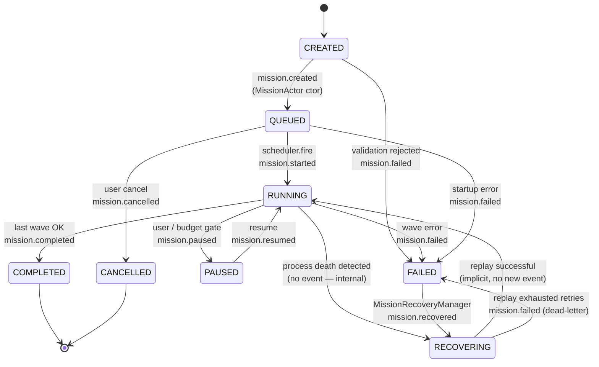

# JARVIS Mission State Machine

**Status:** FROZEN at M6.1.A (2026-07-08, architect-approved; R1 audit passed — see `docs/r1_synthetic_event_review.md`)
**Authority:** Rank 4 (companion document to `docs/107_PHASE_45_PERSISTENT_AUTONOMOUS_RUNTIME_SPECIFICATION.md` §4.1, §9, §13)
**Author:** Phase 45 spec, M6.1.A deliverable

> **Frozen contract.** The 8 lifecycle events in §"8 Lifecycle Events" below are the
> ONLY mission-lifecycle events the codebase is permitted to publish on `EventBusInterface`
> (CR-3.3). The state set in §"States" is the ONLY set a mission can occupy. The
> transitions in the diagram below are the ONLY legal transitions. Any addition,
> removal, or rename is a STOP condition (spec §9) and requires a fresh CR per
> AGENTS.md §8.

---

## Purpose

This document is the **canonical state diagram** for a JARVIS mission. It is the single
place to read what every legal transition is — both for review by humans and for unit tests
that assert transition validity.

If code in `MissionActor` ever attempts a transition not shown here, the test suite fails.
Any addition of a transition MUST be coordinated through a Change Request per AGENTS.md §8
and reflected here.

---

## The 8 Lifecycle Events (frozen contract)

These names are **frozen in M6.1.A**. They will not be renamed without a CR. They are the
only events a mission can emit; everything else (REST, WebSocket, metrics, dashboard,
recovery journal) is a derived view of these.

| # | Event | Triggered by | Payload (frozen keys) |
|---|-------|--------------|------------------------|
| 1 | `mission.created` | `MissionActor.__init__` | `mission_id`, `goal`, `created_at` |
| 2 | `mission.started` | state transition `QUEUED → RUNNING` | `mission_id`, `wave_idx` |
| 3 | `mission.paused` | state transition `RUNNING → PAUSED` | `mission_id`, `reason` |
| 4 | `mission.resumed` | state transition `PAUSED → RUNNING` | `mission_id`, `wave_idx` |
| 5 | `mission.completed` | state transition `RUNNING → COMPLETED` | `mission_id`, `duration_ms`, `checkpoint_seq` |
| 6 | `mission.failed` | state transition `RUNNING → FAILED` (or `QUEUED → FAILED`) | `mission_id`, `error`, `wave_idx` |
| 7 | `mission.recovered` | boot rehydration OR replay path | `mission_id`, `wave_run_id`, `from_seq` |
| 8 | `mission.cancelled` | explicit cancel | `mission_id`, `reason` |

> **Note:** Each event corresponds to **one** transition. `mission.recovered` is special —
> it can fire on boot (rehydration) AND on replay (post-crash recovery). It always carries
> `wave_run_id` so consumers can distinguish them if needed.

---

## States

A JARVIS mission is always in **exactly one** of these states:

- `CREATED` — actor constructed, goal accepted, no execution started yet.
- `QUEUED` — accepted and waiting for an executor slot (scheduler-fired or API-submitted).
- `RUNNING` — actively executing waves; this is the only state in which waves can advance.
- `PAUSED` — user-requested or budget-gate pause; resumable.
- `COMPLETED` — terminal success state. No further transitions.
- `FAILED` — terminal error state. No further transitions except via `RECOVERING`.
- `RECOVERING` — recovery manager is replaying from last checkpoint; not visible to
  end-users except via `mission.recovered` events.
- `CANCELLED` — terminal explicit-cancel state. No further transitions.

> **Terminal states** (no out-edges): `COMPLETED`, `CANCELLED`. Every other state has
> at least one outgoing transition.

---

## Diagram (Mermaid)

> **Edge semantics:**
> - `RUNNING → RECOVERING` does not emit an event — it is detected post-mortem when a new
>   process boots and sees the mission stuck in `RUNNING` with a stale heartbeat.
> - `RECOVERING → RUNNING` does not emit `mission.started` either — the mission never left
>   a logical user-facing `RUNNING` state; only `mission.recovered` was emitted on the way
>   in. This avoids event-storm spam on restart.

---

## Transition Authorisation

Each transition listed above is **authorised by exactly one actor**:

| Transition | Authorised by | Invariant |
|---|---|---|
| `CREATED → QUEUED` | `MissionActor.__init__` | P-1 (checkpoint before state change) |
| `CREATED → FAILED` | `MissionActor.validate()` | P-1 |
| `QUEUED → RUNNING` | `MissionActor.start()` | P-1 |
| `QUEUED → CANCELLED` | `MissionActor.cancel()` | P-1 |
| `QUEUED → FAILED` | `MissionActor.fail_on_startup()` | P-1 |
| `RUNNING → PAUSED` | `MissionActor.pause()` | P-1 |
| `PAUSED → RUNNING` | `MissionActor.resume()` | P-1 |
| `RUNNING → COMPLETED` | `MissionActor.complete()` | P-1 |
| `RUNNING → FAILED` | `MissionActor.fail_on_wave()` | P-1 |
| `RUNNING → RECOVERING` | `MissionRecoveryManager.detect_orphans()` (NEW in 6.3) | R-1 |
| `FAILED → RECOVERING` | `MissionRecoveryManager.replay()` (NEW in 6.3) | R-1 |
| `RECOVERING → RUNNING` | `MissionRecoveryManager.replay()` (NEW in 6.3) | R-1 |
| `RECOVERING → FAILED` | `MissionRecoveryManager.replay()` (NEW in 6.3) | R-1, R-2 (dead-letter) |

> Per **CR-1** (architect-approved 2026-07-08): **only `MissionActor` methods may initiate a
> transition**. `MissionManager`, `ScheduledMissionDispatcher`, `MissionRecoveryManager`,
> and `DistributedRouter` may all *invoke* actor methods; they may not write to the DB
> directly to change state.

---

## Invariants (cross-references)

| Invariant | Spec ref | Enforced by |
|---|---|---|
| P-1 — write-through to DB before state change | §4.1 | `MissionActor` write-through logic |
| P-2 — inconsistent checkpoint_seq → refuse to start | §4.1 | `MissionActor.start()` precondition |
| P-3 — (CR-1) no state mutation outside `MissionActor` | §4.1 | test suite + architecture audit |
| R-1 — at-least-once wave execution | §4.3 | `wave_run_id` idempotency check |
| R-2 — dead-letter queue | §4.3 | `MissionRecoveryManager.replay()` |
| S-1..S-3 — scheduler invariants | §4.2 | scheduler unit tests |

---

## What this doc is NOT

- This is **not** a transition-spec for swarm tasks. Swarm tasks have their own state
  machine in `core/swarm/state_machine.py` (existing).
- This is **not** an event-schema spec. The payload keys above are frozen as
  Pydantic models in `core/mission/events.py` (M6.1.A deliverable).
- This is **not** the per-mission timeline view. The timeline lives in
  `MissionModel.lifecycle_timeline` (JSONB column) and is a runtime trace, not a state.

---

## Maintenance Rules

1. To add a transition: open a CR per AGENTS.md §8; if approved, edit this file and bump
   the frozen-event contract in `core/mission/events.py`.
2. To rename an event: forbidden without a CR. The 8 event names in `## 8 Lifecycle Events`
   are literal contract — consumers in Phases 27 / 6.5 / 6.4 may already depend on them.
3. To remove a state: think twice. Most removals are reframings. If genuinely necessary,
   CR + delete.
