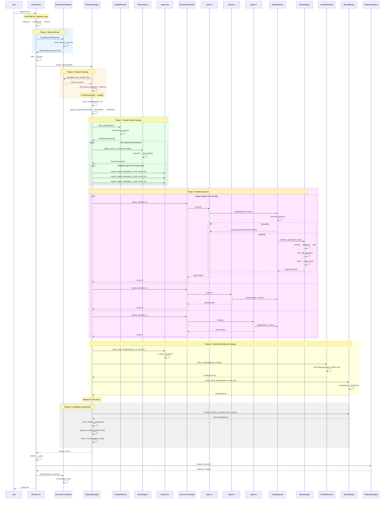
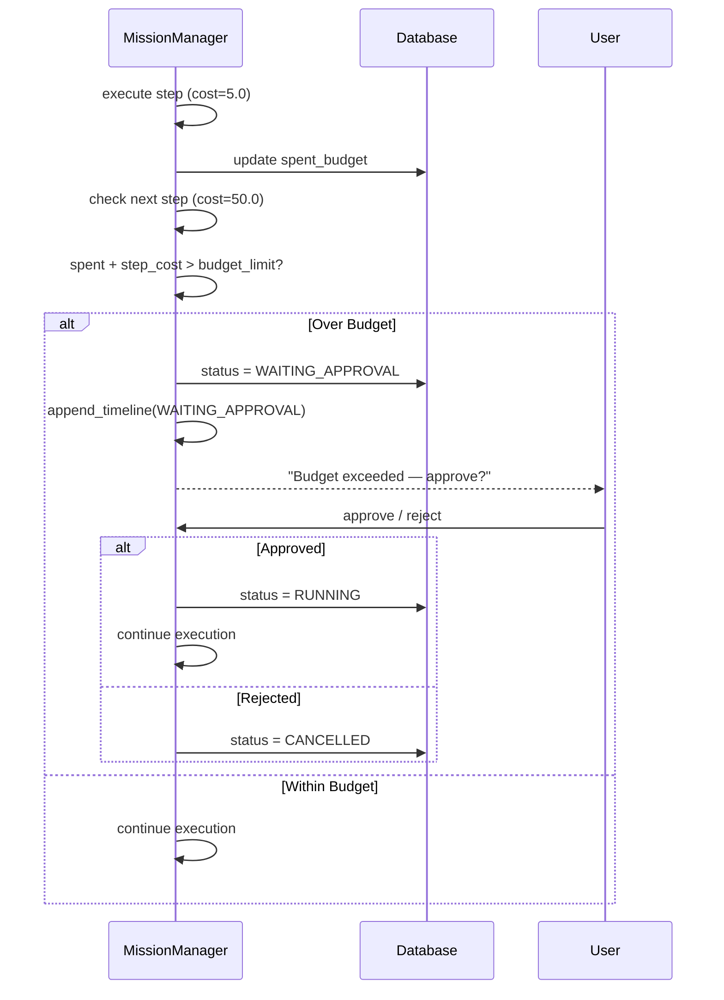
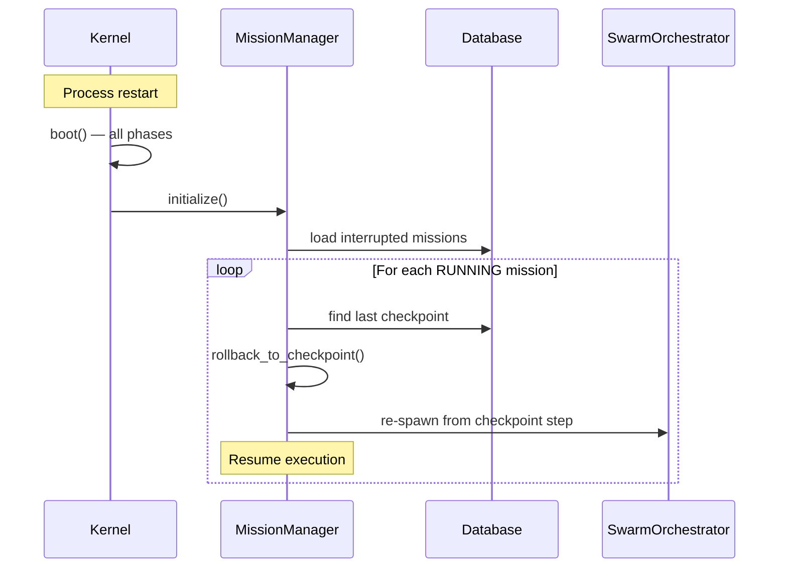

# JARVIS OS — Mission Execution Sequence Diagram

**Version:** v0.9.0-rc1  
**Date:** 2026-07-08

## Full Mission Lifecycle

## Budget Gate Flow (Sequential Path)

## Crash Recovery Flow

## Component Legend

| Symbol | Component | File |
|--------|-----------|------|
| BK | BrainKernel | `core/runtime/brain_kernel.py` |
| MO | MemoryOrchestrator | `core/memory/orchestrator.py` |
| MM | MissionManager | `core/runtime/mission.py` |
| PP | ParallelPlanner | `core/runtime/parallel_planner.py` |
| RA | RoleAssigner | `core/runtime/role_assigner.py` |
| SV | Supervisor | `core/runtime/supervisor.py` |
| SO | SwarmOrchestrator | `core/runtime/orchestrator.py` |
| TD | ToolDispatcher | `core/reasoning/dispatcher.py` |
| RE | RepairEngine | `core/reasoning/repair_engine.py` |
| CR | ConflictResolver | `core/runtime/conflict_resolver.py` |
| RM | ResultMerger | `core/runtime/result_merger.py` |
| RF | ReflectionEngine | `core/reasoning/reflection.py` |
